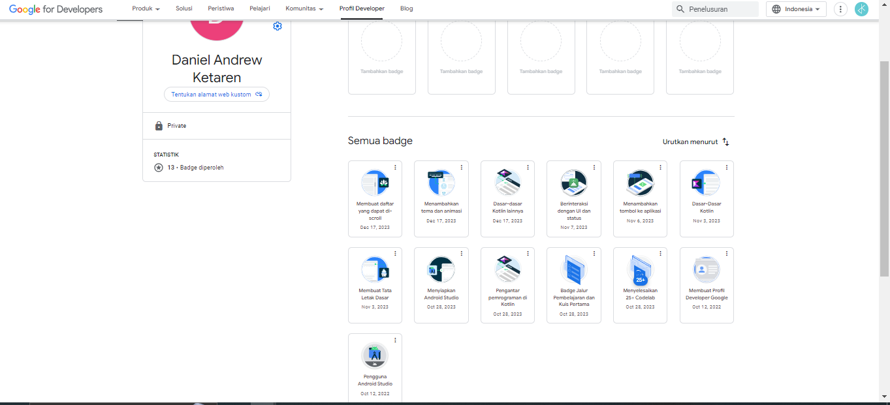
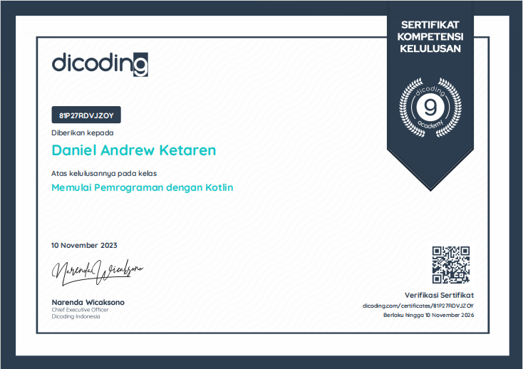

# Implementasi UI - Ujian Akhir Semester Mobile Programming

Nama : Daniel Andrew Ketaren

NIM : 211402062

# Implementasi UI pada Aplikasi Android dengan Menggunakan Flutter

Implementasi UI ini memiliki kemiripan sebesar 96% dimana untuk bagian popular creator masih cenderung sama dengan popular recipes

untuk kesesuaian dapat dibandingkan secara langsung dengan cloning aplikasi ini

# Cara menjalankan kode

1). git clone <https://github.com/Danielketaren2207/daniel_andrew_ketaren_uas_promob>

2). masuk kedalam VSC atau Aplikasi pemprograman

3). Run (flutter pub get)

4). Buka Emulator

5). Run Without Debugging.

# Sertifikat Tubes dan Badge

